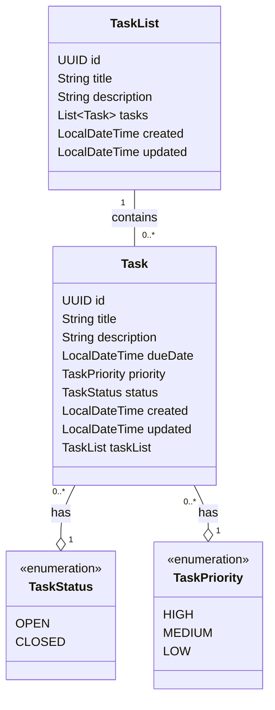

# Task Tracker API

A robust RESTful API built with Spring Boot for managing projects, to-do lists, and individual tasks. This application supports task prioritization, status tracking, and automatic progress calculation for task lists.

## 🚀 Features

* **Task List Management**: Create, read, update, and delete collections of tasks.
* **Granular Task Control**: Manage individual tasks within specific lists.
* **Automatic Progress Tracking**: The API automatically calculates the completion percentage (0.0 to 1.0) of a Task List based on how many tasks are marked `CLOSED`.
* **Smart Updates**: Uses `PATCH` semantics to update only the fields provided in the request (e.g., updating just the status of a task).
* **Prioritization**: Assign `HIGH`, `MEDIUM`, or `LOW` priority to tasks. Defaults to `MEDIUM` if not specified.
* **Audit Fields**: Automatically maintains `created` and `updated` timestamps for all entities.

## 🛠 Tech Stack

* **Java 21**: Core language.
* **Spring Boot**: Framework for REST API creation.
* **Spring Data JPA**: For database abstraction and repository management.
* **ModelMapper**: For clean mapping between Database Entities and API DTOs.
* **Lombok**: Reduces boilerplate code.
* **Database**: Compatible with any SQL database (H2, PostgreSQL, MySQL) supported by Hibernate.

## 📐 Domain Model

The core of the application is built on a bidirectional relationship between `TaskList` and `Task`, ensuring data integrity and easy navigation.

* **One-to-Many**: A single `TaskList` acts as a container for multiple `Task` entities.
* **Many-to-One**: Each `Task` is linked back to a single specific `TaskList` via the `task_list_id` foreign key.
* **Automatic Auditing**: Both entities track their lifecycle using `created` and `updated` timestamps.



## 📂 Project Structure

The project follows a standard layered architecture:

* `controllers`: REST controllers handling HTTP requests (`TaskController`, `TaskListController`).
* `domain.entities`: Database entities (`Task`, `TaskList`).
* `domain.dtos`: Data Transfer Objects for API responses/requests.
* `mappers`: Configuration and interfaces for object mapping.
* `services`: Business logic (Interfaces implemented, implementation details pending).

## 🚀 Features

* **Task Lists**: Create, Read, Update, and Delete (CRUD) lists to organize tasks.
* **Task Management**: Add tasks to specific lists with details like Title, Description, and Due Date.
* **Status Tracking**: Track tasks as `OPEN` or `CLOSED`.
* **Prioritization**: Assign priorities (`HIGH`, `MEDIUM`, `LOW`) to tasks.
* **Progress Monitoring**: *[Inferred]* DTOs suggest functionality to calculate the percentage of completed tasks within a list.

## 🔌 API Endpoints

### Task Lists

| Method | Endpoint | Description |
| :--- | :--- | :--- |
| `GET` | `/api/v1/task-lists` | Retrieve all task lists. |
| `POST` | `/api/v1/task-lists` | Create a new task list. |
| `GET` | `/api/v1/task-lists/{id}` | Get a specific task list by ID. |
| `PATCH` | `/api/v1/task-lists/{id}` | Update a task list. |
| `DELETE` | `/api/v1/task-lists/{id}` | Delete a task list. |

### Tasks

| Method | Endpoint | Description |
| :--- | :--- | :--- |
| `GET` | `/api/v1/task-lists/{list_id}/tasks` | Retrieve all tasks within a specific list. |
| `POST` | `/api/v1/task-lists/{list_id}/tasks` | Create a new task in a specific list. |
| `GET` | `/api/v1/task-lists/{list_id}/tasks/{id}` | Get a specific task details. |
| `PATCH` | `/api/v1/task-lists/{list_id}/tasks/{id}` | Update a task (e.g., mark as CLOSED). |
| `DELETE` | `/api/v1/task-lists/{list_id}/tasks/{id}` | Remove a task. |

## 📦 Data Models

### Task List
Represents a container for tasks.
* **Attributes**: `id`, `title`, `description`, `created`, `updated`.
* **Computed (DTO)**: `count` (total tasks), `progress` (completion percentage).

### Task
Represents an individual unit of work.
* **Attributes**: `id`, `title`, `description`, `dueDate`, `priority`, `status`, `created`, `updated`.
* **Enums**:
    * `TaskStatus`: OPEN, CLOSED
    * `TaskPriority`: HIGH, MEDIUM, LOW

## 📦 Payload Examples

### Creating a Task List
**POST** `/api/v1/task-lists`

```json
{
  "title": "First Entry",
  "description": "This is first entry as a Task List",
}
```
### Creating a Task
**POST** `/api/v1/task-lists/{list_uuid}/tasks`

```json
{
  "title" : "First Entry",
  "description" : "This is first entry as a Task" 
}
```

### Response Example (Task List with Progress)
**GET** `/api/v1/task-lists/{list_uuid}`
```json
{
  "id" : "c613e592-12c8-472d-8b01-123456789abc",
  "title" : "First Entry",
  "description" : "This is first entry as a Task List",
  "count" : 2,
  "progress" : 0.5,
  "tasks" : [
    {
      "id" : "951f8eb8-d170-4191-bbd6-38896699c0eb",
      "title" : "1",
      "description" : "1",
      "dueDate" : "2025-12-28T12:00:00",
      "priority" : "HIGH",
      "status" : "OPEN"
    },
    {
      "id" : "9c828d0e-674f-4f8a-9fd9-38c73c4dec2b",
      "title" : "2",
      "description" : "2",
      "dueDate" : "2025-12-28T12:00:00",
      "priority" : "LOW",
      "status" : "CLOSED"
    }
  ]
}
```

## ⚙️ Logic Highlights
### Progress Calculation
The following logic used in `TaskListMapperImpl` was taken from a **YT video of Devtiro**! It is there to determine the progress of a list based on closed tasks:
```Java
long count = tasks.stream()
        .filter(task -> TaskStatus.CLOSED == task.getStatus())
        .count();
return (double) count / tasks.size();
```

### Task Creation Rules
When creating a task via `TaskServiceImpl`, the application enforces specific business rules:

 - Validation: Checks if the linked TaskList exists.
 - Timestamps: Automatically sets created and updated timestamps to now().
 - Defaults:
     - Priority defaults to `MEDIUM` if not provided.
     - Status is forced to `OPEN` upon creation.

## 🏃‍♂️ How to Run

1.  **Clone the repository**.
```Bash
  git clone https://github.com/notsohan/TaskTrackerApp.git
```
2.  **Configure Database**: Ensure your `application.properties` is configured for your database (e.g., H2 console enabled or PostgreSQL credentials).
3.  Navigate to the project directory.
```Bash
  cd TaskTrackerApp
```
4.  **Build**:
```bash
 ./mvnw clean install
```
5.  Run the application using Maven/Gradle wrapper or the main class `TaskTrackerApplication`.
```bash
  ./mvnw spring-boot:run
```
  
